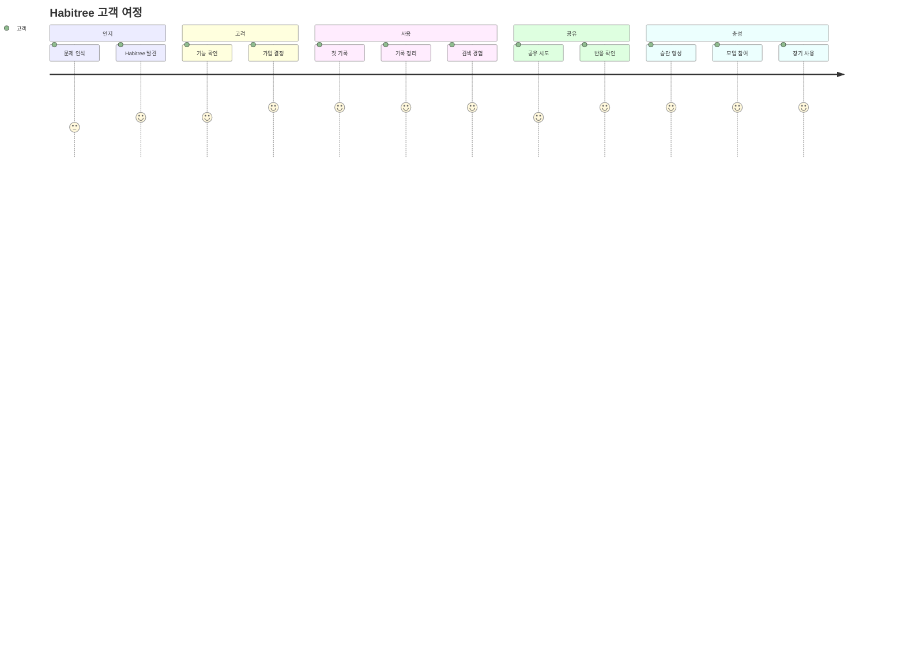

# Customer Experience (고객 경험)

## 개요

이 문서는 Habitree Reading Hub를 사용하는 고객의 실제 경험을 상세히 묘사합니다. Working Backwards 스타일로 "고객의 1주일 사용 흐름"과 주요 터치포인트, WOW 모멘트를 정의합니다.

---

## 고객 여정 (Customer Journey)

### 단계별 고객 여정



---

## 시간별 고객 경험

### 🧭 📅 Day 1 — 가입 & 첫 기록

#### 터치포인트
1. **앱 다운로드 / 웹 접속**
   - 검색 또는 추천을 통해 Habitree 발견
   - "책 기록 플랫폼"이라는 설명 확인

2. **간편 가입**
   - 카카오/구글로 빠른 가입 (소셜 로그인)
   - 추가 정보 입력 최소화

3. **온보딩 경험**
   - "올해 읽은 책 수 목표" 설정
   - 간단한 튜토리얼 (30초 이내)

4. **첫 책 추가**
   - ISBN 검색 또는 책 표지 촬영
   - 책 정보 자동 입력 확인

5. **첫 기록 작성**
   - 필사 입력 또는 사진 업로드
   - 기록이 책에 자동 연결되는 것 확인

#### 고객 느낌
> "아, 이제 내가 저장한 문장이 사라지지 않겠구나."

#### 감정 곡선
- **기대감:** 높음 (새로운 도구에 대한 기대)
- **안도감:** 높음 (기록이 안전하게 저장됨)
- **만족도:** 높음 (간편한 사용 경험)

---

### 🧭 📅 Day 2 — 기록 자동 정리 경험

#### 터치포인트
1. **기존 기록 불러오기**
   - 기존에 찍어둔 사진 불러오기
   - 여러 장의 사진을 한 번에 업로드

2. **자동 정리 확인**
   - 자동으로 "책/페이지/문장"으로 묶임
   - OCR로 텍스트 자동 추출 확인

3. **기록 정렬 확인**
   - 내 필사/사진이 책 내부에서 정렬됨
   - 페이지 순서대로 자동 정리됨

#### 고객 느낌
> "내 기록이 하나의 책처럼 정돈된다."

#### 감정 곡선
- **놀라움:** 높음 (자동 정리 기능)
- **편의성:** 높음 (수동 작업 불필요)
- **신뢰도:** 증가 (플랫폼에 대한 신뢰 형성)

---

### 🧭 📅 Day 3 — 공유 경험

#### 터치포인트
1. **인상 깊은 문장 선택**
   - 저장한 문장 중 하나 선택
   - 공유 버튼 클릭

2. **자동 카드뉴스 생성**
   - 문장이 자동으로 카드뉴스 형태로 변환
   - 다양한 템플릿 선택 가능

3. **SNS 공유**
   - 인스타그램, 카카오톡, 블로그 등 선택
   - 한 번의 클릭으로 공유 완료

4. **반응 확인**
   - "와 이 문장 좋다!" 반응 받음
   - 공유로 인한 긍정적 피드백

#### 고객 느낌
> "내 기록을 공유하는 게 즐겁다."

#### 감정 곡선
- **자신감:** 증가 (기록을 공유할 수 있다는 자신감)
- **만족도:** 높음 (공유 기능의 편의성)
- **사회적 연결:** 증가 (다른 사람과의 소통)

---

### 🧭 📅 Day 5 — 모임/챌린지 참여

#### 터치포인트
1. **독서모임 발견**
   - 독서모임 리더가 만든 그룹 발견
   - 모임 정보 및 참여 조건 확인

2. **모임 참여**
   - 그룹에 참여 신청
   - 승인 후 모임 멤버가 됨

3. **읽기 현황 체크**
   - 오늘 읽은 분량 체크
   - 진행률 자동 업데이트

4. **기록 공유**
   - 나의 필사/메모가 그룹 대시보드에 반영
   - 다른 멤버의 기록도 확인 가능

#### 고객 느낌
> "다른 사람들과 함께 읽는 게 동기부여가 된다."

#### 감정 곡선
- **소속감:** 증가 (모임에 참여하는 느낌)
- **동기부여:** 증가 (다른 사람의 기록을 보며 자극받음)
- **책임감:** 증가 (모임에 기여하고 싶은 마음)

---

### 🧭 📅 Day 7 — 누적 기록을 보는 첫 경험

#### 터치포인트
1. **독서 통계 확인**
   - 이번 주 읽은 시간/페이지 확인
   - 목표 대비 진행률 확인

2. **타임라인 조회**
   - 내가 저장한 필사/문장/메모 리스트가 타임라인 형태로 정리
   - 날짜순, 책순으로 정렬 가능

3. **기록 내보내기**
   - PDF/이미지로 내보내기 가능
   - 개인 아카이브로 저장

#### 고객 느낌
> "드디어 내 독서가 한눈에 보인다. 이건 계속하고 싶다."

#### 감정 곡선
- **성취감:** 매우 높음 (누적된 기록을 보며 성취감 느낌)
- **만족도:** 매우 높음 (플랫폼의 가치를 실감)
- **지속 의지:** 증가 (계속 사용하고 싶은 마음)

---

## 주요 WOW 모멘트

### 1. 첫 자동 정리 경험 (Day 2)

**상황:** 여러 장의 사진을 업로드했을 때 자동으로 책별, 페이지별로 정리되는 순간

**고객 반응:**  
> "와, 이렇게 자동으로 정리되다니! 내가 일일이 정리할 필요가 없네."

**왜 WOW인가?**
- 사용자가 기대하지 않은 편의성
- 수동 작업을 완전히 대체하는 자동화
- 즉각적인 가치 제공

---

### 2. 문장 검색 성공 (Day 3 이후)

**상황:** 몇 달 전에 읽은 책의 특정 문장을 검색해서 찾아낸 순간

**고객 반응:**  
> "이 문장이 여기 있었구나! 드디어 찾았다."

**왜 WOW인가?**
- 고객의 핵심 문제를 해결하는 순간
- 다른 도구로는 불가능했던 경험
- 감정적 보상 제공

---

### 3. 공유 후 긍정적 반응 (Day 3)

**상황:** 공유한 문장에 대해 많은 좋아요와 댓글을 받은 순간

**고객 반응:**  
> "내가 공유한 문장이 이렇게 많은 사람들에게 공감을 받다니."

**왜 WOW인가?**
- 사회적 인정 욕구 충족
- 공유의 즐거움 발견
- 지속 사용 동기 부여

---

### 4. 독서 타임라인 조회 (Day 7)

**상황:** 한 달간의 독서 기록을 타임라인으로 한눈에 본 순간

**고객 반응:**  
> "내가 이렇게 많은 책을 읽고 기록했구나. 정말 뿌듯하다."

**왜 WOW인가?**
- 시각적 성취감 제공
- 독서 습관의 지속성 확인
- 감정적 보상

---

## 페르소나별 주요 경험

### 개인 독자 (김서연)

**핵심 경험:**
- 기록의 안전한 보관
- 빠른 검색으로 문장 재발견
- 개인 타임라인으로 성장 확인

**주요 터치포인트:**
1. 첫 기록 작성
2. 문장 검색 성공
3. 타임라인 조회
4. 공유 후 반응

---

### 독서모임 운영자 (이준호)

**핵심 경험:**
- 구성원 진행 상황 한눈에 파악
- 운영 부담 감소
- 모임 질 향상

**주요 터치포인트:**
1. 모임 생성 및 구성원 초대
2. 대시보드에서 진행 상황 확인
3. 구성원 기록 확인 및 피드백
4. 모임 리포트 생성

---

### 크리에이터 (박민지)

**핵심 경험:**
- 구독자와 함께 읽기 활동 운영
- 플랫폼 통합 관리
- 커뮤니티 형성

**주요 터치포인트:**
1. 챌린지 생성 및 운영
2. 구독자 참여 현황 확인
3. 기록 기반 콘텐츠 제작
4. 커뮤니티 활성화

---

## 감정 곡선 (Emotional Journey)

### 전체 여정 감정 변화

```
높음 │                    ╭─╮
     │         ╭─╮      ╱   ╲
     │    ╭─╮ ╱   ╲    ╱     ╲
     │   ╱   ╲╱     ╲  ╱       ╲
     │  ╱           ╲╱         ╲
낮음 └─────────────────────────────
     Day1  Day2  Day3  Day5  Day7
```

**주요 감정 변화:**
- **Day 1:** 기대감, 호기심
- **Day 2:** 놀라움, 편의성 인지
- **Day 3:** 자신감, 만족도 증가
- **Day 5:** 소속감, 동기부여
- **Day 7:** 성취감, 지속 의지

---

## 주요 터치포인트 체크리스트

- [x] 첫 가입 경험이 간편한가?
- [x] 첫 기록 작성이 쉬운가?
- [x] 자동 정리 기능이 명확히 보이는가?
- [x] 검색 기능이 직관적인가?
- [x] 공유 기능이 편리한가?
- [x] 타임라인 조회가 시각적으로 매력적인가?
- [x] 모임 기능이 쉽게 사용 가능한가?
- [x] 각 단계에서 WOW 모멘트가 있는가?

---

## 경험 개선 포인트

### 단기 개선 (MVP)
1. 온보딩 시간 단축 (30초 이내)
2. 첫 기록 작성 가이드 강화
3. 자동 정리 결과 즉시 피드백

### 중기 개선 (v2)
1. 개인화된 추천 기능
2. 더 다양한 공유 템플릿
3. 독서 리포트 자동 생성

### 장기 개선 (v3+)
1. AI 기반 문장 추천
2. 커뮤니티 기능 강화
3. Book Circulation 기능 추가

