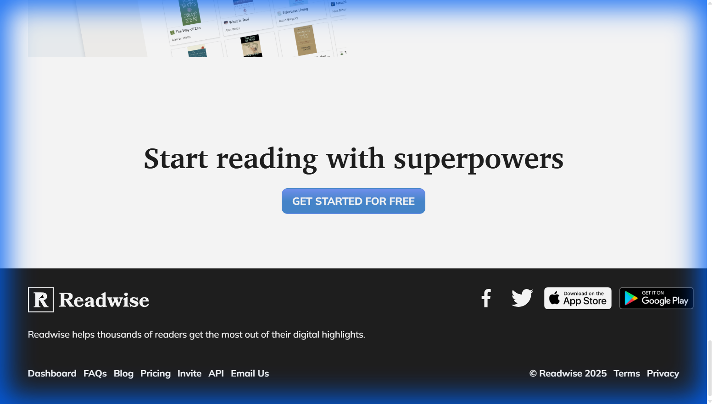
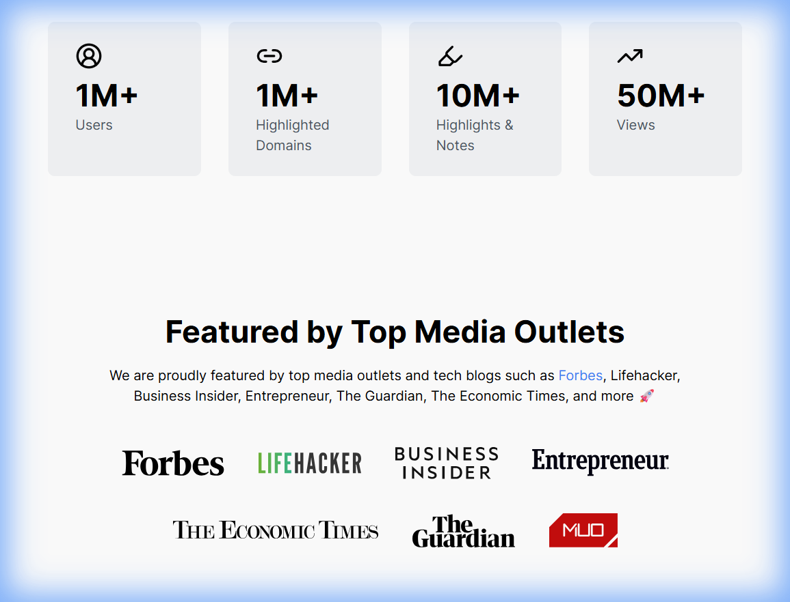
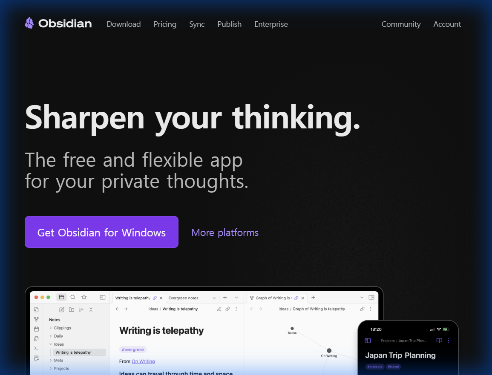

# Readtree 랜딩 페이지 디자인 레퍼런스 조사

본 문서는 Readtree(by Habitree) 서비스의 랜딩 페이지 개선을 위해 유사 서비스 및 우수 디자인 사례를 조사한 결과입니다.

## 1. 조사 개요
- **목적**: 독서 기록 및 지식 관리 서비스에 적합한 신뢰감 있고 매력적인 랜딩 페이지 디자인 탐색
- **주요 키워드**: 독서(Reading), 기록(Note-taking), 지식 관리(PKM), 연결(Connection)
- **조사 대상**: Readwise, Glasp, Obsidian, Notion

## 2. 주요 레퍼런스 분석

### A. Readwise (독서 기록 관리)
가장 직접적인 경쟁사이자 롤모델입니다. "책을 읽고 잊어버리는 문제"를 해결한다는 가치를 명확히 전달합니다.

*   **특징**:
    *   **타이포그래피**: 세리프(Serif) 폰트를 사용하여 '책', '지성', '진지함'의 느낌을 줍니다.
    *   **구성**: 화려한 그래픽보다 텍스트와 여백을 강조하여 콘텐츠에 집중하게 합니다.
    *   **메시지**: "Grow wiser", "Retain books better" 등 짧고 강력한 문구 사용.
*   **Readtree 적용 포인트**:
    *   헤드라인에 명조 계열(Noto Serif KR) 폰트를 사용하여 독서 플랫폼으로서의 정체성 강조.
    *   복잡한 기능 설명보다 "문장을 다시 찾을 수 있다"는 핵심 가치에 집중.

### B. Glasp (소셜 하이라이팅)
웹상의 글을 하이라이트하고 공유하는 서비스입니다. 커뮤니티성과 현대적인 느낌이 강합니다.

*   **특징**:
    *   **카드 UI**: 다양한 정보(통계, 사용자, 카테고리)를 카드 형태로 깔끔하게 정리했습니다.
    *   **색상**: 화이트 배경에 소프트한 블루/옐로우 등을 포인트로 사용하여 경쾌한 느낌.
    *   **소셜 증거**: 하단에 유명 언론사나 파트너 로고를 배치하여 신뢰도 상승.
*   **Readtree 적용 포인트**:
    *   공유 기능(카드뉴스 등)을 설명할 때 Glasp와 같은 카드 형태의 비주얼 활용.
    *   FAQ나 고객 후기 섹션에 유사한 카드 레이아웃 적용.

### C. Obsidian (개인 지식 관리)
'제2의 뇌'를 표방하는 지식 연결 도구입니다. 전문가들을 위한 도구라는 느낌을 줍니다.

*   **특징**:
    *   **다크 모드**: 깊이 있는 사고와 집중을 유도하는 다크 테마를 메인으로 사용.
    *   **제품 중심**: 추상적인 이미지가 아닌, 실제 앱 구동 화면(복잡한 연결 그래프)을 대문짝만하게 보여주어 기능을 직관적으로 자랑함.
*   **Readtree 적용 포인트**:
    *   만약 '집중 모드'나 '밤에 읽기' 기능을 강조한다면 다크 모드 섹션을 추가.
    *   실제 앱의 '타임라인'이나 '검색 화면' 스크린샷을 고화질로 배치.

### D. Notion (올인원 워크스페이스)
설명이 필요 없는 생산성 도구의 표준입니다.

*   **특징**:
    *   **일러스트레이션**: 친근하고 직관적인 핸드 드로잉 스타일의 일러스트로 딱딱함을 덜어냄.
    *   **그리드 레이아웃**: 복잡한 기능을 'Bento Grid' 스타일로 나누어 하나하나 명확히 설명.
*   **Readtree 적용 포인트**:
    *   다양한 기능(필사, 검색, 공유)을 한 번에 보여주기보다, Notion처럼 섹션을 나누어 아이콘/일러스트와 함께 설명.

## 3. 종합 제안

Readtree의 브랜드 이미지(Forest, Green, Growth)와 기능을 고려할 때 다음과 같은 방향을 제안합니다.

1.  **메인 컨셉**: **"도서관의 고요함 + 숲의 생명력"**
    *   Readwise의 **세리프 폰트**를 사용하여 차분하고 지적인 분위기 조성.
    *   Habitree의 **에메랄드 그린**을 포인트 컬러로 사용하여 신뢰와 성장의 이미지 전달.
2.  **레이아웃 전략**:
    *   **Hero Section**: 간결한 메시지("당신의 독서는 사라지지 않습니다")와 함께 앱의 핵심 화면(문장 수집 화면)을 목업으로 배치.
    *   **Features**: Notion 스타일의 그리드 레이아웃을 변형하여, [기록] - [검색] - [공유] 세 가지 기둥을 시각적으로 분리하여 설명.
    *   **Social Proof**: Glasp처럼 실제 사용자들의 후기나 공유된 카드뉴스 예시를 나열.

이 문서는 `docs/assets` 폴더에 저장된 이미지를 참조하고 있습니다.
