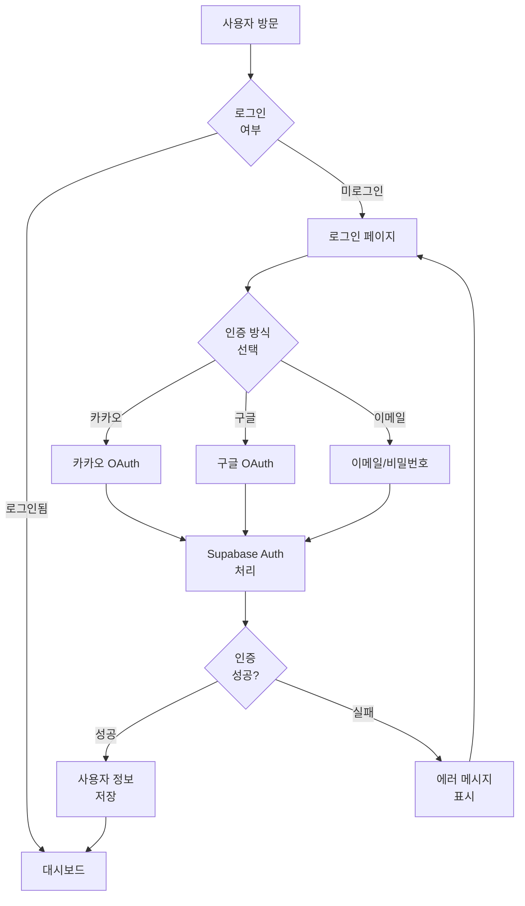
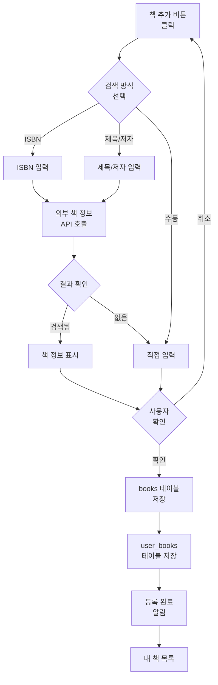
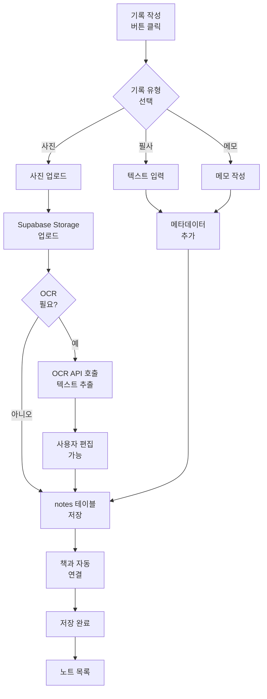
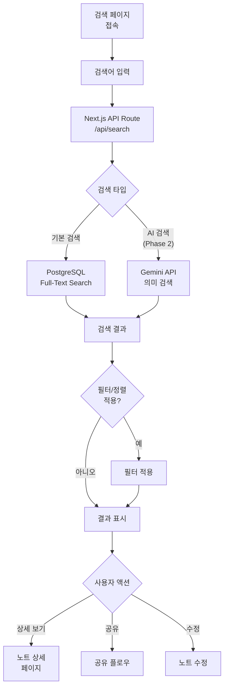
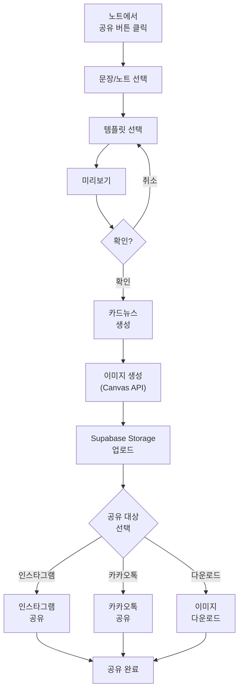

# 소프트웨어 디자인: 사용자 플로우 다이어그램 및 API 상세 명세

이 문서는 software_design.md에 추가될 섹션입니다.

## 6. 사용자 플로우 다이어그램

### 6.1 회원가입 및 로그인 플로우



### 6.2 책 등록 플로우



### 6.3 필사/메모 작성 플로우



### 6.4 검색 플로우



### 6.5 공유 플로우



## 7. API 엔드포인트 상세 명세

### 7.1 책 관련 API

#### POST /api/books/search
책 검색 (외부 API 연동)

**Request:**
```typescript
{
  q: string;           // 검색어
  type?: 'isbn' | 'title' | 'author';
  limit?: number;      // 기본 20
}
```

**Response:**
```typescript
{
  success: boolean;
  data: Array<{
    isbn: string;
    title: string;
    author: string;
    publisher: string;
    cover_image_url: string;
    description: string;
    published_date: string;
  }>;
}
```

#### POST /api/books
책 등록

**Request:**
```typescript
{
  isbn?: string;
  title: string;
  author: string;
  publisher?: string;
  cover_image?: File;  // 이미지 업로드
  status: 'want_to_read' | 'reading' | 'completed';
  started_at?: string;
  completed_at?: string;
}
```

**Response:**
```typescript
{
  success: boolean;
  data: {
    book_id: string;
    user_book_id: string;
  };
}
```

### 7.2 노트 관련 API

#### POST /api/notes
노트 생성

**Request:**
```typescript
{
  book_id: string;
  type: 'quote' | 'photo' | 'memo';
  content?: string;
  image?: File;
  page_number?: number;
  tags?: string[];
  is_public?: boolean;
}
```

**Response:**
```typescript
{
  success: boolean;
  data: {
    note_id: string;
    image_url?: string;
    ocr_result?: string;  // OCR 처리된 경우
  };
}
```

#### GET /api/notes
노트 목록 조회

**Query Parameters:**
```typescript
{
  book_id?: string;
  type?: 'quote' | 'photo' | 'memo';
  tags?: string[];
  limit?: number;
  offset?: number;
  sort?: 'created_at' | 'page_number';
}
```

**Response:**
```typescript
{
  success: boolean;
  data: Array<{
    id: string;
    book: {
      id: string;
      title: string;
      author: string;
      cover_image_url: string;
    };
    type: string;
    content: string;
    image_url?: string;
    page_number?: number;
    tags: string[];
    is_public: boolean;
    created_at: string;
  }>;
  total: number;
}
```

### 7.3 검색 API

#### GET /api/search
노트 검색 (Full-Text Search)

**Query Parameters:**
```typescript
{
  q: string;           // 검색어
  book_id?: string;
  type?: 'quote' | 'photo' | 'memo';
  date_from?: string;
  date_to?: string;
  tags?: string[];
  limit?: number;
}
```

**Response:**
```typescript
{
  success: boolean;
  data: Array<{
    note_id: string;
    book_title: string;
    content: string;
    highlight: string;  // 하이라이트된 검색 결과
    relevance_score: number;
  }>;
}
```

#### POST /api/search/ai (Phase 2)
Gemini API 기반 의미 검색

**Request:**
```typescript
{
  query: string;
  context?: string;
}
```

**Response:**
```typescript
{
  success: boolean;
  data: {
    results: Array<{
      note_id: string;
      content: string;
      similarity_score: number;
      explanation?: string;
    }>;
    insights?: string;
  };
}
```

### 7.4 독서모임 API

#### POST /api/groups
독서모임 생성

**Request:**
```typescript
{
  name: string;
  description?: string;
  book_ids?: string[];
}
```

**Response:**
```typescript
{
  success: boolean;
  data: {
    group_id: string;
  };
}
```

#### GET /api/groups/[groupId]/activities
모임 활동 조회 (Realtime)

**Response:**
```typescript
{
  success: boolean;
  data: {
    members: Array<{
      user_id: string;
      name: string;
      avatar_url: string;
      progress: number;
      recent_notes: Array<Note>;
    }>;
    books: Array<Book>;
    recent_activities: Array<Activity>;
  };
}
```

### 7.5 타임라인 API

#### GET /api/timeline
독서 타임라인 조회

**Query Parameters:**
```typescript
{
  start_date?: string;
  end_date?: string;
  view?: 'day' | 'week' | 'month';
}
```

**Response:**
```typescript
{
  success: boolean;
  data: Array<{
    date: string;
    books_read: number;
    notes_created: number;
    activities: Array<{
      type: 'book_added' | 'note_created' | 'book_completed';
      timestamp: string;
      details: any;
    }>;
  }>;
}
```

## 8. 배포 및 환경 설정

### 8.1 환경 변수

```env
# Supabase
NEXT_PUBLIC_SUPABASE_URL=
NEXT_PUBLIC_SUPABASE_ANON_KEY=
SUPABASE_SERVICE_ROLE_KEY=

# OCR API
GOOGLE_CLOUD_VISION_API_KEY=

# 책 정보 API
ALADIN_API_KEY=
NAVER_CLIENT_ID=
NAVER_CLIENT_SECRET=

# Gemini API
GEMINI_API_KEY=

# Sentry (에러 추적)
SENTRY_DSN=

# Vercel
NEXT_PUBLIC_VERCEL_URL=
```

### 8.2 Vercel 배포 설정

```json
{
  "buildCommand": "pnpm build",
  "devCommand": "pnpm dev",
  "installCommand": "pnpm install",
  "framework": "nextjs",
  "regions": ["icn1"]
}
```

### 8.3 성능 최적화

- **이미지 최적화**: next/image 사용
- **코드 스플리팅**: 동적 임포트 활용
- **캐싱**: React Query 캐시 전략
- **Database Connection Pooling**: Supabase 연결 풀링
- **CDN**: Vercel Edge Network

---

**문서 작성일**: 2025년 12월  
**최종 업데이트**: 2025년 12월  
**버전**: 1.0
