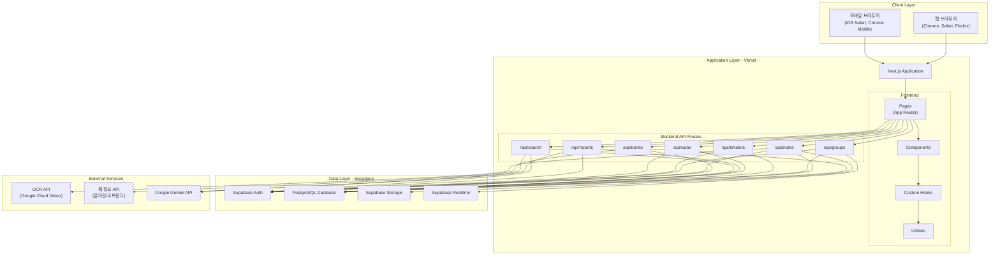
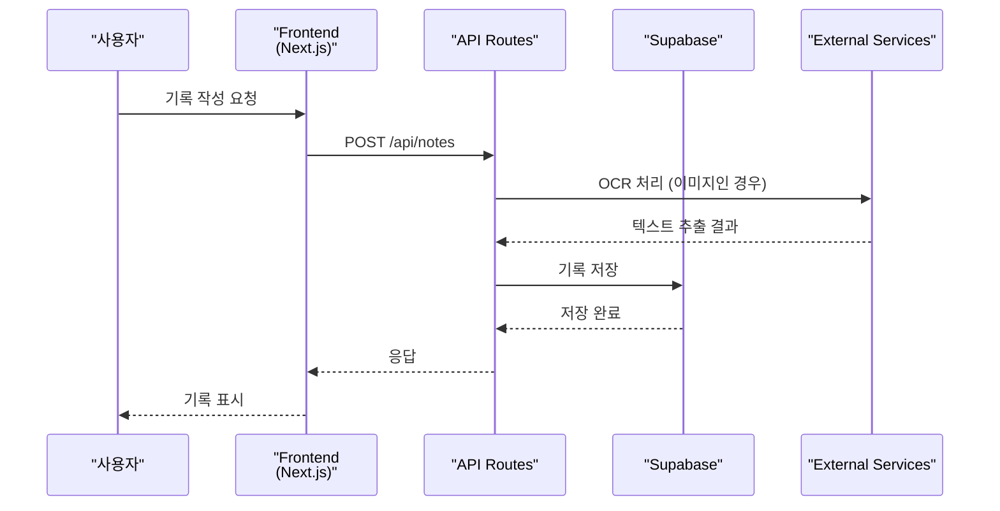
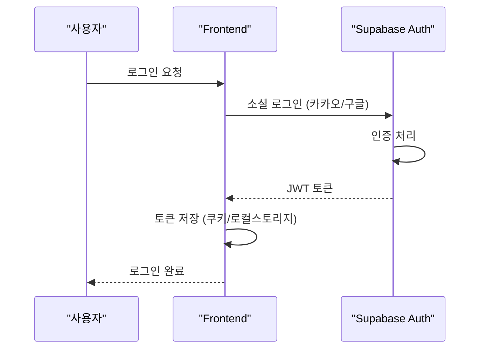
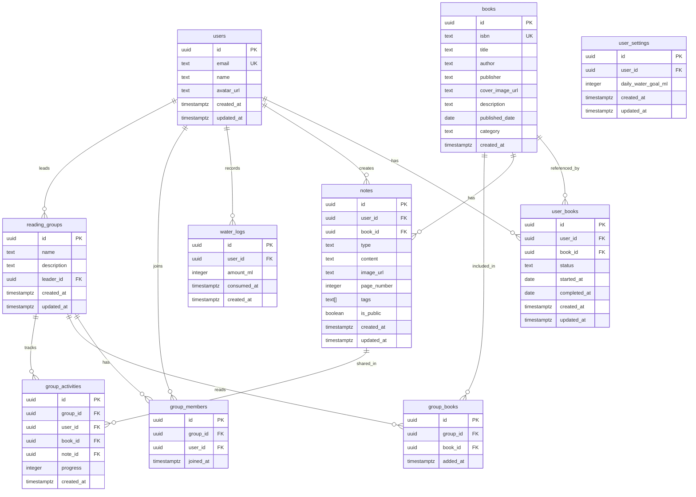
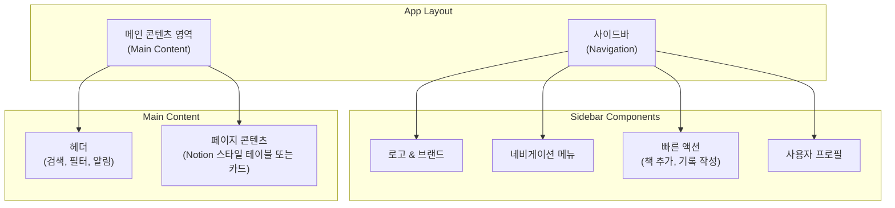
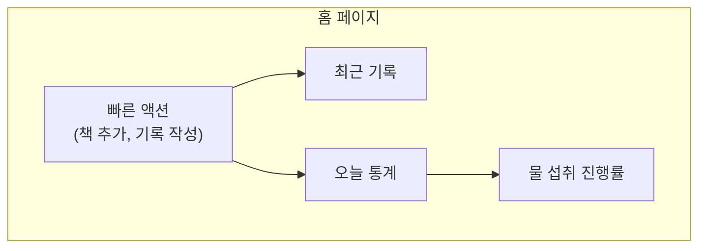
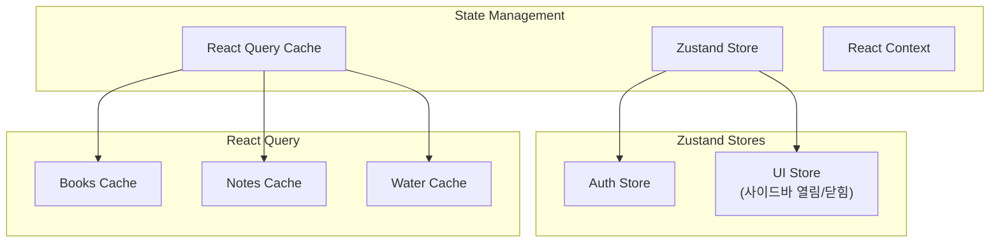
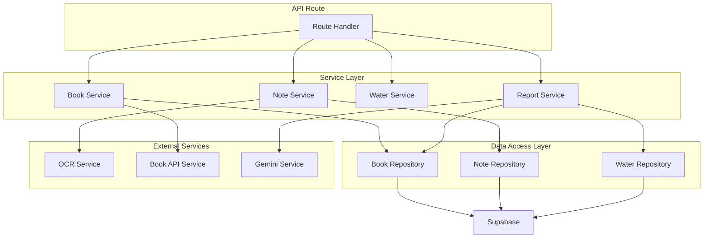
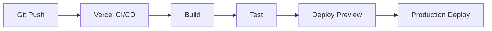

# 소프트웨어 디자인 및 아키텍처 문서

**문서 버전**: 1.0  
**작성일**: 2025년 12월  
**제품명**: Readtree 독서플랫폼 (Readtree by Habitree)

---

## 1. 기술 스택

### 1.1 Frontend

- **Framework**: Next.js 14+ (App Router)
- **Language**: TypeScript 5.0+
- **Styling**: Tailwind CSS 3.4+
- **UI 컴포넌트**: 
  - Radix UI (접근성 우선 컴포넌트)
  - shadcn/ui (재사용 가능한 컴포넌트)
- **State Management**: 
  - Zustand (전역 상태 관리)
  - React Context API (인증 상태 등)
- **Form Management**: React Hook Form + Zod
- **Data Fetching**: 
  - TanStack Query (React Query) v5
  - SWR (선택적)
- **Date Handling**: date-fns
- **Chart/Visualization**: Recharts 또는 Chart.js
- **Image Processing**: 
  - next/image (이미지 최적화)
  - react-dropzone (파일 업로드)

### 1.2 Backend

- **Runtime**: Node.js 20+
- **Framework**: Next.js API Routes (App Router)
- **Language**: TypeScript
- **Database Client**: 
  - Supabase Client (PostgreSQL)
  - Prisma (선택적, ORM)
- **Authentication**: Supabase Auth
- **File Storage**: Supabase Storage
- **Real-time**: Supabase Realtime

### 1.3 Database & Storage

- **Database**: Supabase PostgreSQL 15+
- **Storage**: Supabase Storage (S3 호환)
- **Search**: PostgreSQL Full-Text Search (GIN 인덱스)

### 1.4 External Services

- **OCR**: Google Cloud Vision API 또는 Tesseract.js
- **책 정보 API**: 
  - 알라딘 API
  - 교보문고 API
  - 네이버 도서 API
- **AI/LLM**: Google Gemini API (Gemini Pro)
- **Image Processing**: Sharp (서버 사이드 이미지 처리)

### 1.5 Infrastructure & DevOps

- **Hosting**: Vercel (Serverless)
- **CI/CD**: Vercel Git Integration
- **Environment Variables**: Vercel Environment Variables
- **Monitoring**: 
  - Vercel Analytics
  - Sentry (에러 추적)
- **Version Control**: Git (GitHub/GitLab)

### 1.6 Development Tools

- **Package Manager**: pnpm 또는 npm
- **Linting**: ESLint + Prettier
- **Type Checking**: TypeScript
- **Testing**: 
  - Jest + React Testing Library
  - Playwright (E2E 테스트)

---

## 2. 시스템 아키텍처

### 2.1 전체 시스템 아키텍처



### 2.2 데이터 흐름도



### 2.3 인증 흐름도



---

## 3. 데이터베이스 설계

### 3.1 ERD (Entity Relationship Diagram)



### 3.2 데이터베이스 스키마

#### 3.2.1 users 테이블

```sql
CREATE TABLE users (
  id UUID PRIMARY KEY DEFAULT gen_random_uuid(),
  email TEXT UNIQUE NOT NULL,
  name TEXT,
  avatar_url TEXT,
  created_at TIMESTAMPTZ DEFAULT NOW(),
  updated_at TIMESTAMPTZ DEFAULT NOW()
);

CREATE INDEX idx_users_email ON users(email);
```

#### 3.2.2 books 테이블

```sql
CREATE TABLE books (
  id UUID PRIMARY KEY DEFAULT gen_random_uuid(),
  isbn TEXT UNIQUE,
  title TEXT NOT NULL,
  author TEXT,
  publisher TEXT,
  cover_image_url TEXT,
  description TEXT,
  published_date DATE,
  category TEXT,
  created_at TIMESTAMPTZ DEFAULT NOW()
);

CREATE INDEX idx_books_isbn ON books(isbn);
CREATE INDEX idx_books_title ON books(title);
```

#### 3.2.3 user_books 테이블

```sql
CREATE TABLE user_books (
  id UUID PRIMARY KEY DEFAULT gen_random_uuid(),
  user_id UUID REFERENCES users(id) ON DELETE CASCADE,
  book_id UUID REFERENCES books(id) ON DELETE CASCADE,
  status TEXT CHECK (status IN ('want_to_read', 'reading', 'completed')) DEFAULT 'want_to_read',
  started_at DATE,
  completed_at DATE,
  created_at TIMESTAMPTZ DEFAULT NOW(),
  updated_at TIMESTAMPTZ DEFAULT NOW(),
  UNIQUE(user_id, book_id)
);

CREATE INDEX idx_user_books_user_id ON user_books(user_id);
CREATE INDEX idx_user_books_status ON user_books(status);
```

#### 3.2.4 notes 테이블

```sql
CREATE TABLE notes (
  id UUID PRIMARY KEY DEFAULT gen_random_uuid(),
  user_id UUID REFERENCES users(id) ON DELETE CASCADE,
  book_id UUID REFERENCES books(id) ON DELETE CASCADE,
  type TEXT CHECK (type IN ('quote', 'photo', 'memo')) NOT NULL,
  content TEXT,
  image_url TEXT,
  page_number INTEGER,
  tags TEXT[] DEFAULT '{}',
  is_public BOOLEAN DEFAULT false,
  created_at TIMESTAMPTZ DEFAULT NOW(),
  updated_at TIMESTAMPTZ DEFAULT NOW()
);

-- Full-text search를 위한 인덱스
CREATE INDEX idx_notes_content_search ON notes USING gin(to_tsvector('korean', content));
CREATE INDEX idx_notes_user_book ON notes(user_id, book_id);
CREATE INDEX idx_notes_created_at ON notes(created_at DESC);
CREATE INDEX idx_notes_tags ON notes USING gin(tags);
```

#### 3.2.5 water_logs 테이블 (물 마신 기록)

```sql
CREATE TABLE water_logs (
  id UUID PRIMARY KEY DEFAULT gen_random_uuid(),
  user_id UUID REFERENCES users(id) ON DELETE CASCADE,
  amount_ml INTEGER NOT NULL CHECK (amount_ml > 0),
  consumed_at TIMESTAMPTZ DEFAULT NOW(),
  created_at TIMESTAMPTZ DEFAULT NOW()
);

CREATE INDEX idx_water_logs_user_id ON water_logs(user_id);
CREATE INDEX idx_water_logs_consumed_at ON water_logs(user_id, consumed_at DESC);
```

#### 3.2.6 user_settings 테이블 (사용자 설정)

```sql
CREATE TABLE user_settings (
  id UUID PRIMARY KEY DEFAULT gen_random_uuid(),
  user_id UUID REFERENCES users(id) ON DELETE CASCADE UNIQUE,
  daily_water_goal_ml INTEGER DEFAULT 2000 CHECK (daily_water_goal_ml > 0),
  created_at TIMESTAMPTZ DEFAULT NOW(),
  updated_at TIMESTAMPTZ DEFAULT NOW()
);

CREATE INDEX idx_user_settings_user_id ON user_settings(user_id);
```

#### 3.2.7 reading_groups 테이블

```sql
CREATE TABLE reading_groups (
  id UUID PRIMARY KEY DEFAULT gen_random_uuid(),
  name TEXT NOT NULL,
  description TEXT,
  leader_id UUID REFERENCES users(id) ON DELETE CASCADE,
  created_at TIMESTAMPTZ DEFAULT NOW(),
  updated_at TIMESTAMPTZ DEFAULT NOW()
);

CREATE INDEX idx_reading_groups_leader_id ON reading_groups(leader_id);
```

#### 3.2.8 group_members 테이블

```sql
CREATE TABLE group_members (
  id UUID PRIMARY KEY DEFAULT gen_random_uuid(),
  group_id UUID REFERENCES reading_groups(id) ON DELETE CASCADE,
  user_id UUID REFERENCES users(id) ON DELETE CASCADE,
  joined_at TIMESTAMPTZ DEFAULT NOW(),
  UNIQUE(group_id, user_id)
);

CREATE INDEX idx_group_members_group_id ON group_members(group_id);
CREATE INDEX idx_group_members_user_id ON group_members(user_id);
```

#### 3.2.9 group_books 테이블

```sql
CREATE TABLE group_books (
  id UUID PRIMARY KEY DEFAULT gen_random_uuid(),
  group_id UUID REFERENCES reading_groups(id) ON DELETE CASCADE,
  book_id UUID REFERENCES books(id) ON DELETE CASCADE,
  added_at TIMESTAMPTZ DEFAULT NOW(),
  UNIQUE(group_id, book_id)
);

CREATE INDEX idx_group_books_group_id ON group_books(group_id);
```

#### 3.2.10 group_activities 테이블

```sql
CREATE TABLE group_activities (
  id UUID PRIMARY KEY DEFAULT gen_random_uuid(),
  group_id UUID REFERENCES reading_groups(id) ON DELETE CASCADE,
  user_id UUID REFERENCES users(id) ON DELETE CASCADE,
  book_id UUID REFERENCES books(id) ON DELETE CASCADE,
  note_id UUID REFERENCES notes(id) ON DELETE SET NULL,
  progress INTEGER CHECK (progress >= 0 AND progress <= 100),
  created_at TIMESTAMPTZ DEFAULT NOW()
);

CREATE INDEX idx_group_activities_group_id ON group_activities(group_id);
CREATE INDEX idx_group_activities_created_at ON group_activities(created_at DESC);
```

### 3.3 Row Level Security (RLS) 정책

```sql
-- notes 테이블 RLS
ALTER TABLE notes ENABLE ROW LEVEL SECURITY;

CREATE POLICY "Users can view own notes" ON notes
  FOR SELECT USING (auth.uid() = user_id);

CREATE POLICY "Users can insert own notes" ON notes
  FOR INSERT WITH CHECK (auth.uid() = user_id);

CREATE POLICY "Users can update own notes" ON notes
  FOR UPDATE USING (auth.uid() = user_id);

CREATE POLICY "Users can delete own notes" ON notes
  FOR DELETE USING (auth.uid() = user_id);

-- 공개된 노트는 모든 사용자가 조회 가능
CREATE POLICY "Public notes are viewable by everyone" ON notes
  FOR SELECT USING (is_public = true);

-- water_logs 테이블 RLS
ALTER TABLE water_logs ENABLE ROW LEVEL SECURITY;

CREATE POLICY "Users can view own water logs" ON water_logs
  FOR SELECT USING (auth.uid() = user_id);

CREATE POLICY "Users can insert own water logs" ON water_logs
  FOR INSERT WITH CHECK (auth.uid() = user_id);

CREATE POLICY "Users can update own water logs" ON water_logs
  FOR UPDATE USING (auth.uid() = user_id);

CREATE POLICY "Users can delete own water logs" ON water_logs
  FOR DELETE USING (auth.uid() = user_id);

-- user_books 테이블 RLS
ALTER TABLE user_books ENABLE ROW LEVEL SECURITY;

CREATE POLICY "Users can manage own user_books" ON user_books
  FOR ALL USING (auth.uid() = user_id);
```

---

## 4. 프론트엔드 설계

### 4.1 디자인 시스템

#### 4.1.1 디자인 원칙

랜딩 페이지 레퍼런스 조사 결과를 바탕으로 다음 디자인 원칙을 적용합니다:

**참고 레퍼런스**: [landing_page_references.md](file:///d:/onedrive/3.TREVARI/WB/docs/landing_page_references.md)

1. **"도서관의 고요함 + 숲의 생명력"** (Readtree 브랜드 아이덴티티)
   - Readwise 스타일의 세리프 폰트로 지적이고 차분한 분위기
   - Habitree의 에메랄드 그린을 포인트 컬러로 사용

2. **반응형 웹 디자인** (모바일 우선, Mobile First)
   - 웹과 앱 모두에서 활용 가능한 반응형 레이아웃
   - 터치 친화적인 UI 요소 (최소 44x44px 터치 타겟)

3. **접근성** (WCAG 2.1 AA 준수)
   - 색상 대비비 4.5:1 이상
   - 키보드 탐색 지원

4. **일관성**
   - 일관된 색상 팔레트, 타이포그래피, 간격 사용
   - 디자인 토큰 기반 시스템

#### 4.1.2 색상 팔레트

Habitree 브랜드와 랜딩 페이지 레퍼런스를 바탕으로 한 색상 체계:

```typescript
// tailwind.config.ts
const colors = {
  // Habitree 에메랄드 그린 (포인트 컬러)
  primary: {
    50: '#f0fdf4',
    100: '#dcfce7',
    200: '#bbf7d0',
    300: '#86efac',
    400: '#4ade80',
    500: '#10b981', // 메인 에메랄드 그린
    600: '#059669',
    700: '#047857',
    800: '#065f46',
    900: '#064e3b',
  },
  // 중성 색상 (Readwise 스타일의 차분한 톤)
  gray: {
    50: '#fafafa',
    100: '#f4f4f5',
    200: '#e4e4e7',
    300: '#d4d4d8',
    400: '#a1a1aa',
    500: '#71717a',
    600: '#52525b',
    700: '#3f3f46',
    800: '#27272a',
    900: '#18181b',
  },
  // 상태 색상
  success: '#10b981',
  warning: '#f59e0b',
  error: '#ef4444',
  info: '#3b82f6',
  
  // 배경 색상
  background: {
    primary: '#ffffff',
    secondary: '#f9fafb',
    tertiary: '#f0f9ff',
  },
}
```

#### 4.1.3 타이포그래피

독서 플랫폼으로서의 정체성을 강조하기 위한 타이포그래피 시스템:

```typescript
// 폰트 패밀리
const fontFamily = {
  serif: ['Noto Serif KR', 'serif'], // 헤드라인, 책 제목
  sans: ['Noto Sans KR', 'Inter', 'sans-serif'], // 본문, UI 요소
}

// 폰트 크기
const fontSize = {
  // 헤드라인 (세리프 폰트 사용)
  'display-lg': '48px',    // 랜딩 페이지 메인 헤드라인
  'display-md': '36px',    // 페이지 타이틀
  'display-sm': '30px',    // 섹션 타이틀
  
  // 제목 (세리프 또는 산세리프)
  'title-lg': '24px',      // 카드 타이틀
  'title-md': '20px',      // 서브 타이틀
  'title-sm': '18px',      // 작은 타이틀
  
  // 본문 (산세리프)
  'body-lg': '16px',       // 기본 본문
  'body-md': '14px',       // 작은 본문
  'body-sm': '12px',       // 캡션, 메타 정보
}

// 라인 높이
const lineHeight = {
  heading: 1.2,    // 헤드라인
  title: 1.3,      // 제목
  body: 1.6,       // 본문 (독서 플랫폼에 적합한 여유로운 행간)
}
```

#### 4.1.4 간격 시스템

```typescript
const spacing = {
  xs: '4px',
  sm: '8px',
  md: '16px',
  lg: '24px',
  xl: '32px',
  '2xl': '48px',
  '3xl': '64px',
}

### 4.2 레이아웃 구조

#### 4.2.1 전체 레이아웃

HABITREE MAIN 이미지와 유사한 형태의 레이아웃 구조:




#### 4.2.2 사이드바 구조

**디자인 참고**: Obsidian 스타일의 간결하고 기능적인 사이드바

```typescript
// 사이드바 메뉴 구조
const sidebarMenu = [
  {
    id: 'home',
    label: '홈',
    icon: 'Home',
    path: '/',
    description: '대시보드 및 최근 활동',
  },
  {
    id: 'books',
    label: '내 책',
    icon: 'Book',
    path: '/books',
    description: '책 관리 (Notion 스타일 테이블)',
  },
  {
    id: 'notes',
    label: '노트',
    icon: 'FileText',
    path: '/notes',
    description: '필사, 사진, 메모',
  },
  {
    id: 'timeline',
    label: '타임라인',
    icon: 'Calendar',
    path: '/timeline',
    description: '독서 기록 타임라인',
  },
  {
    id: 'search',
    label: '검색',
    icon: 'Search',
    path: '/search',
    description: '문장 단위 검색',
  },
  {
    id: 'groups',
    label: '독서모임',
    icon: 'Users',
    path: '/groups',
    description: '모임 관리',
  },
  {
    id: 'reports',
    label: '리포트',
    icon: 'BarChart',
    path: '/reports',
    description: '독서 통계 및 분석',
  },
]
```

**사이드바 기능**:
- 홈 이동 및 메뉴 간 이동
- 빠른 액션 버튼 (책 추가, 기록 작성)
- 사용자 프로필 및 설정
- 반응형: 데스크톱에서는 항상 표시, 모바일에서는 드로어 형태

#### 4.2.3 메인 페이지 구조 (HABITREE MAIN 스타일)

**Hero Section** (랜딩 페이지):
- 간결한 메시지: "당신의 독서는 사라지지 않습니다"
- 앱 핵심 화면 목업 (문장 수집 화면)
- 에메랄드 그린 포인트 컬러
- Readwise 스타일의 세리프 폰트 헤드라인

**Features Section**:
- Notion 스타일의 그리드 레이아웃
- 세 가지 핵심 기둥: [기록] - [검색] - [공유]
- 각 기능별로 아이콘과 설명

**Social Proof Section**:
- Glasp 스타일의 카드 UI
- 실제 사용자 후기
- 공유된 카드뉴스 예시

#### 4.2.4 책 관리 페이지 (Notion 스타일 테이블)

**노션 레퍼런스**: 

책 정보를 노션 형태의 테이블 구조로 관리:

```typescript
// 책 테이블 컬럼 구조
const bookTableColumns = [
  {
    id: 'cover',
    label: '표지',
    type: 'image',
    width: '60px',
  },
  {
    id: 'title',
    label: '제목',
    type: 'text',
    width: 'auto',
    searchable: true,
  },
  {
    id: 'author',
    label: '저자',
    type: 'text',
    width: '150px',
    searchable: true,
  },
  {
    id: 'status',
    label: '상태',
    type: 'select',
    width: '120px',
    options: [
      { value: 'want_to_read', label: '읽고 싶은', color: 'gray' },
      { value: 'reading', label: '읽는 중', color: 'blue' },
      { value: 'completed', label: '완료', color: 'green' },
    ],
  },
  {
    id: 'notes_count',
    label: '노트 수',
    type: 'number',
    width: '80px',
  },
  {
    id: 'started_at',
    label: '시작일',
    type: 'date',
    width: '120px',
  },
  {
    id: 'completed_at',
    label: '완료일',
    type: 'date',
    width: '120px',
  },
  {
    id: 'actions',
    label: '액션',
    type: 'actions',
    width: '100px',
  },
]
```

**테이블 기능**:
- 정렬 (제목, 저자, 날짜별)
- 필터링 (상태별, 카테고리별)
- 검색 (제목, 저자)
- 인라인 편집
- 드래그 앤 드롭 정렬
- 뷰 전환 (테이블 / 카드 / 타임라인)


### 4.3 컴포넌트 구조

```
src/
├── app/                    # Next.js App Router
│   ├── layout.tsx          # 루트 레이아웃
│   ├── page.tsx            # 홈 페이지
│   ├── books/
│   ├── timeline/
│   ├── water/
│   ├── reports/
│   └── groups/
├── components/
│   ├── layout/
│   │   ├── Sidebar.tsx     # 사이드바
│   │   ├── Header.tsx       # 헤더
│   │   └── Layout.tsx       # 메인 레이아웃
│   ├── books/
│   │   ├── BookCard.tsx
│   │   ├── BookList.tsx
│   │   └── BookSearch.tsx
│   ├── notes/
│   │   ├── NoteCard.tsx
│   │   ├── NoteForm.tsx
│   │   └── NoteList.tsx
│   ├── water/
│   │   ├── WaterLogForm.tsx
│   │   ├── WaterChart.tsx
│   │   └── WaterStats.tsx
│   ├── timeline/
│   │   ├── TimelineView.tsx
│   │   └── TimelineItem.tsx
│   └── shared/
│       ├── Button.tsx
│       ├── Input.tsx
│       └── Modal.tsx
├── hooks/
│   ├── useBooks.ts
│   ├── useNotes.ts
│   ├── useWater.ts
│   └── useAuth.ts
├── lib/
│   ├── supabase/
│   ├── api/
│   └── utils/
└── types/
    ├── book.ts
    ├── note.ts
    └── water.ts
```

### 4.4 주요 페이지 설계

#### 4.4.1 홈 페이지 (대시보드)



#### 4.4.2 타임라인 페이지

- **구글 캘린더 스타일**: 월별/주별 뷰
- **타임라인 뷰**: 시간순 기록 표시
- **필터링**: 날짜, 책, 기록 유형별 필터

#### 4.4.3 물 기록 페이지

- **오늘 섭취량**: 진행률 바와 통계
- **기록 입력**: 빠른 버튼 (200ml, 500ml)
- **차트**: 일별/주별/월별 섭취량 그래프
- **기록 목록**: 시간순 기록 리스트

### 4.5 반응형 디자인

#### 4.5.1 브레이크포인트

```typescript
const breakpoints = {
  sm: '640px',   // 모바일
  md: '768px',   // 태블릿
  lg: '1024px',  // 데스크톱
  xl: '1280px',  // 큰 데스크톱
}
```

#### 4.5.2 사이드바 반응형 동작

- **데스크톱 (lg 이상)**: 항상 표시
- **태블릿 (md)**: 토글 가능, 오버레이
- **모바일 (sm)**: 햄버거 메뉴, 드로어 형태

### 4.6 상태 관리



---

## 5. 백엔드 설계

### 5.1 API Routes 구조

```
app/
├── api/
│   ├── books/
│   │   ├── route.ts          # GET, POST /api/books
│   │   └── [id]/
│   │       └── route.ts      # GET, PUT, DELETE /api/books/[id]
│   ├── books/
│   │   └── search/
│   │       └── route.ts      # GET /api/books/search
│   ├── notes/
│   │   ├── route.ts          # GET, POST /api/notes
│   │   ├── [id]/
│   │   │   └── route.ts      # GET, PUT, DELETE /api/notes/[id]
│   │   ├── search/
│   │   │   └── route.ts      # GET /api/notes/search
│   │   └── share/
│   │       └── route.ts      # POST /api/notes/share
│   ├── water/
│   │   ├── route.ts          # GET, POST /api/water
│   │   ├── [id]/
│   │   │   └── route.ts      # PUT, DELETE /api/water/[id]
│   │   └── stats/
│   │       └── route.ts      # GET /api/water/stats
│   ├── timeline/
│   │   └── route.ts          # GET /api/timeline
│   ├── reports/
│   │   ├── reading/
│   │   │   └── route.ts      # GET /api/reports/reading
│   │   ├── water/
│   │   │   └── route.ts      # GET /api/reports/water
│   │   └── health/
│   │       └── route.ts      # GET /api/reports/health
│   ├── groups/
│   │   ├── route.ts          # GET, POST /api/groups
│   │   └── [id]/
│   │       ├── route.ts      # GET, PUT, DELETE
│   │       └── activities/
│   │           └── route.ts  # GET /api/groups/[id]/activities
│   └── ai/
│       └── search/
│           └── route.ts      # POST /api/ai/search
```

### 5.2 API 엔드포인트 상세

#### 5.2.1 Books API

**GET /api/books**
- 사용자의 책 목록 조회
- Query Parameters:
  - `status`: 'want_to_read' | 'reading' | 'completed'
  - `page`: 페이지 번호
  - `limit`: 페이지당 항목 수

**POST /api/books**
- 책 등록
- Request Body:
```typescript
{
  isbn?: string;
  title: string;
  author?: string;
  publisher?: string;
  cover_image_url?: string;
}
```

**GET /api/books/search**
- 책 검색
- Query Parameters:
  - `q`: 검색어
  - `isbn`: ISBN 번호

#### 5.2.2 Notes API

**GET /api/notes**
- 기록 목록 조회
- Query Parameters:
  - `bookId`: 책 ID
  - `type`: 'quote' | 'photo' | 'memo'
  - `date`: 날짜 필터
  - `tags`: 태그 필터

**POST /api/notes**
- 기록 생성
- Request Body:
```typescript
{
  book_id: string;
  type: 'quote' | 'photo' | 'memo';
  content: string;
  image_url?: string;
  page_number?: number;
  tags?: string[];
}
```

**GET /api/notes/search**
- 문장 단위 검색
- Query Parameters:
  - `q`: 검색어
  - `bookId`: 책 ID
  - `date`: 날짜
  - `tags`: 태그

#### 5.2.3 Water API

**GET /api/water**
- 물 마신 기록 조회
- Query Parameters:
  - `date`: 날짜 (YYYY-MM-DD)
  - `startDate`: 시작 날짜
  - `endDate`: 종료 날짜

**POST /api/water**
- 물 마신 기록 작성
- Request Body:
```typescript
{
  amount_ml: number;
  consumed_at?: string; // ISO 8601
}
```

**GET /api/water/stats**
- 물 섭취 통계
- Query Parameters:
  - `period`: 'day' | 'week' | 'month'

#### 5.2.4 Reports API

**GET /api/reports/reading**
- 독서 리포트 생성
- Query Parameters:
  - `period`: 'week' | 'month'
  - `startDate`: 시작 날짜
  - `endDate`: 종료 날짜

**GET /api/reports/water**
- 물 섭취 리포트 생성
- Query Parameters:
  - `period`: 'week' | 'month'

**GET /api/reports/health**
- 통합 건강 리포트 생성
- Query Parameters:
  - `period`: 'week' | 'month'

#### 5.2.5 AI Search API

**POST /api/ai/search**
- AI 기반 의미 검색
- Request Body:
```typescript
{
  query: string;
  context?: {
    bookId?: string;
    dateRange?: {
      start: string;
      end: string;
    };
  };
}
```

### 5.3 미들웨어 및 인증

```typescript
// middleware.ts
import { createMiddlewareClient } from '@supabase/auth-helpers-nextjs'
import { NextResponse } from 'next/server'
import type { NextRequest } from 'next/server'

export async function middleware(req: NextRequest) {
  const res = NextResponse.next()
  const supabase = createMiddlewareClient({ req, res })
  
  const {
    data: { session },
  } = await supabase.auth.getSession()
  
  // 인증이 필요한 경로 체크
  if (!session && req.nextUrl.pathname.startsWith('/api')) {
    return NextResponse.json(
      { error: 'Unauthorized' },
      { status: 401 }
    )
  }
  
  return res
}

export const config = {
  matcher: ['/api/:path*'],
}
```

### 5.4 에러 처리

```typescript
// lib/api/error-handler.ts
export class APIError extends Error {
  constructor(
    public statusCode: number,
    public message: string,
    public code?: string
  ) {
    super(message)
    this.name = 'APIError'
  }
}

export function handleAPIError(error: unknown) {
  if (error instanceof APIError) {
    return Response.json(
      { error: error.message, code: error.code },
      { status: error.statusCode }
    )
  }
  
  console.error('Unexpected error:', error)
  return Response.json(
    { error: 'Internal server error' },
    { status: 500 }
  )
}
```

### 5.5 비즈니스 로직 레이어



---

## 6. 보안 고려사항

### 6.1 인증 및 인가

- **JWT 토큰**: Supabase Auth에서 발급한 JWT 사용
- **Row Level Security**: Supabase RLS로 데이터 접근 제어
- **API 인증**: 모든 API Route에서 세션 검증

### 6.2 데이터 보안

- **SQL Injection 방지**: 파라미터화된 쿼리 사용
- **XSS 방지**: 입력 데이터 검증 및 이스케이프
- **CSRF 방지**: SameSite 쿠키 설정

### 6.3 파일 업로드 보안

- **파일 타입 검증**: 이미지 파일만 허용
- **파일 크기 제한**: 최대 10MB
- **바이러스 스캔**: 업로드된 파일 검사 (선택적)

---

## 7. 성능 최적화

### 7.1 프론트엔드 최적화

- **코드 스플리팅**: Next.js 자동 코드 스플리팅
- **이미지 최적화**: next/image 사용
- **캐싱**: React Query 캐싱 전략
- **번들 크기**: 동적 임포트 활용

### 7.2 백엔드 최적화

- **데이터베이스 인덱싱**: 자주 조회되는 컬럼 인덱스
- **쿼리 최적화**: N+1 문제 방지
- **캐싱**: Vercel Edge Cache 활용
- **페이지네이션**: 대량 데이터 처리

### 7.3 데이터베이스 최적화

- **인덱스 전략**: 
  - Full-text search 인덱스 (GIN)
  - 복합 인덱스 (user_id, created_at)
- **연결 풀링**: Supabase 연결 풀 최적화
- **쿼리 분석**: EXPLAIN ANALYZE로 쿼리 성능 분석

---

## 8. 배포 및 인프라

### 8.1 배포 프로세스



### 8.2 환경 변수

```bash
# .env.local
NEXT_PUBLIC_SUPABASE_URL=
NEXT_PUBLIC_SUPABASE_ANON_KEY=
SUPABASE_SERVICE_ROLE_KEY=
GOOGLE_CLOUD_VISION_API_KEY=
GEMINI_API_KEY=
BOOK_API_KEY=
```

### 8.3 모니터링

- **에러 추적**: Sentry
- **성능 모니터링**: Vercel Analytics
- **로그 관리**: Vercel Logs

---

**문서 승인**

| 역할 | 이름 | 날짜 | 서명 |
|------|------|------|------|
| 제품 관리자 | | | |
| 기술 리더 | | | |
| 디자인 리더 | | | |

---

© 2025 Readtree by Habitree. 모든 권리 보유

